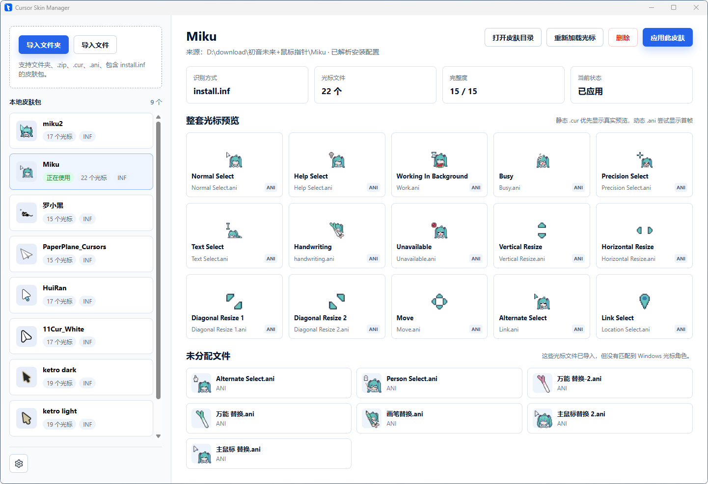

# Cursor Skin Manager

一款简单、专注的 Windows 本地鼠标光标皮肤管理工具。

它可以识别本地 `.cur`、`.ani` 和 `install.inf`，预览整套光标，并一键应用到 Windows 当前用户。所有皮肤都保存在本机，不需要账号，也不包含在线市场、收藏或云同步。

**当前版本：v0.1.11**

**开源许可：[MIT License](LICENSE)**

[下载最新版本](../../releases/latest) · [提交问题](../../issues) · [参与贡献](CONTRIBUTING.md)



## 主要功能

- 导入文件夹、`.zip`、`.cur`、`.ani` 和包含 `install.inf` 的皮肤包。
- 优先解析安装配置，并自动识别 15 个常用 Windows 光标角色。
- 预览静态 `.cur` 和动态 `.ani` 的首帧。
- 一键应用到 Windows 当前用户，无需逐项打开鼠标设置。
- 单独替换某个光标角色，并将未分配文件重新分配到任意角色。
- 管理多套本地皮肤，显示完整度、文件数量和当前应用状态。
- 恢复 Windows 默认光标，安全删除单个皮肤或清空全部皮肤。
- 支持开机自启和关闭窗口时最小化到系统托盘。

## 下载与安装

请前往 [GitHub Releases](../../releases/latest)，展开最新版本的 **Assets** 下载文件。

| 文件 | 适用场景 |
| --- | --- |
| `cursor-skin-manager-x.x.x-x64-setup.exe` | 推荐。包含离线 WebView2 运行库，适合大多数 Windows 电脑。 |
| `cursor-skin-manager-portable-x.x.x.exe` | 便携版，无需安装，但电脑必须已经安装 Microsoft Edge WebView2 Runtime。 |
| `SHA256SUMS-x.x.x.txt` | 用于校验下载文件是否完整。 |

当前安装包因为包含离线 WebView2 运行库，文件体积约为 200 MB，这是正常现象。

### Windows 安全提示

当前公开版本尚未进行商业代码签名，Windows SmartScreen 可能显示“Windows 已保护你的电脑”。请确认文件来自本项目的 GitHub Releases，并核对 SHA-256 后再运行。确认来源可信时，可以点击“更多信息”，然后选择“仍要运行”。

可以在 PowerShell 中计算文件校验值：

```powershell
Get-FileHash ".\cursor-skin-manager-x.x.x-x64-setup.exe" -Algorithm SHA256
```

将结果与 Release 中的 `SHA256SUMS-x.x.x.txt` 对比即可。

## 快速开始

1. 打开 Cursor Skin Manager。
2. 点击左上角的“导入文件夹”或“导入文件”。
3. 选择已解压的光标文件夹、`.zip`、`.cur`、`.ani` 或 `install.inf`。
4. 在左侧选择皮肤，检查右侧的角色预览和完整度。
5. 点击右上角的“应用此皮肤”。

应用会写入当前 Windows 用户的光标配置，一般不需要管理员权限，也不会影响电脑上的其他用户。

## 替换与分配光标

### 替换已分配角色

将鼠标移动到“整套光标预览”中的角色卡片上，点击出现的“替换文件”，然后选择一个有效的 `.cur` 或 `.ani` 文件。

新文件会复制到应用内部目录，不会直接引用或修改原始下载文件。被换下来的旧文件如果没有被其他角色使用，会进入“未分配文件”列表。

### 分配未识别文件

将鼠标移动到“未分配文件”中的文件卡片上，点击“分配到角色”，在弹窗中选择目标角色并确认。

如果目标角色原本已有文件，两个文件会安全交换。修改正在使用的皮肤后，请重新点击“应用此皮肤”让更改生效。

## 支持的格式

| 格式 | 支持情况 |
| --- | --- |
| `.cur` | 支持静态 Windows 光标与真实预览。 |
| `.ani` | 支持动态 Windows 光标，预览优先显示首帧。 |
| `.inf` | 支持常见 Windows 光标安装配置，优先按配置匹配角色。 |
| `.zip` | 支持直接导入压缩包。 |
| 文件夹 | 支持扫描文件夹内的光标和安装配置。 |
| `.rar` / `.7z` | 暂不支持，请先解压后导入文件夹。 |

## 设置

点击左下角的齿轮按钮可以打开设置。

- **开机自启**：默认关闭，启用后会在登录 Windows 时启动应用。
- **关闭窗口时最小化到托盘**：默认开启，关闭主窗口后应用仍在系统托盘运行。
- **恢复默认光标**：将当前用户的鼠标光标恢复为 Windows 默认方案。
- **打开日志**：查看导入、应用、替换和系统刷新记录。
- **清空全部皮肤**：删除应用内部保存的全部皮肤，操作无法撤销。

需要彻底退出应用时，请右键系统托盘图标并选择“退出”。

## 数据与安全

应用数据默认保存在：

```text
%APPDATA%\CursorSkinManager
```

主要文件包括：

| 路径 | 内容 |
| --- | --- |
| `skins\` | 应用内部保存的皮肤与光标文件。 |
| `library.json` | 本地皮肤列表和角色映射。 |
| `settings.json` | 应用设置。 |
| `app.log` | 导入、应用和维护操作日志。 |
| `startup.log` | 启动失败等早期诊断信息。 |

- 导入和替换只会复制文件，不会删除或修改原始下载目录。
- 删除皮肤只会删除应用内部保存的副本。
- 删除正在使用的皮肤时，应用会先恢复 Windows 默认光标。
- 清空全部皮肤不可撤销，重要皮肤请保留原始下载文件。

## 常见问题

### 双击程序没有反应或启动后闪退

优先使用安装版。便携版要求系统已经安装 Microsoft Edge WebView2 Runtime。仍无法启动时，请查看：

```text
%APPDATA%\CursorSkinManager\startup.log
%APPDATA%\CursorSkinManager\app.log
```

提交 Issue 时请附上日志中的错误信息。

### 关闭窗口后应用仍然运行

这是默认行为。应用会最小化到系统托盘，以便后续快速打开。可以在设置中关闭“关闭窗口时最小化到托盘”，也可以从托盘菜单彻底退出。

### 应用皮肤后光标没有立即变化

先点击主界面的“重新加载光标”。如果 Windows 仍未刷新，可以打开系统“鼠标属性”页面，或注销后重新登录当前用户。

### 替换文件后皮肤显示“未应用”

这是正常的安全行为。应用不会在编辑皮肤时静默修改 Windows 注册表，请重新点击“应用此皮肤”。

### 导入后显示“不完整”

这表示皮肤没有匹配全部 15 个 Windows 光标角色。你仍可应用已有角色，未设置的角色会保留当前系统配置；也可以通过“替换文件”和“分配到角色”补齐。

### 为什么有些 `.ani` 只显示一张图片

`.ani` 是动态光标。当前版本在列表和角色卡片中优先显示首帧，实际应用到 Windows 后仍会保留原动画。

## 系统要求与限制

- 推荐 Windows 10 或 Windows 11 64 位系统。
- 当前只修改 Windows 当前用户，不提供全用户系统级安装。
- 暂不支持 macOS、Linux、Windows 主题包、`.rar` 和 `.7z`。
- 当前不包含在线皮肤市场、账号、收藏、标签或云同步。
- ARM Windows 设备尚未进行完整测试。

## 隐私

当前版本不需要登录。皮肤导入、预览、角色匹配和 Windows 光标应用均在本机完成，皮肤文件与配置保存在本地应用数据目录。

## 问题反馈

遇到问题请前往 [GitHub Issues](../../issues)。为了更快定位问题，建议提供：

- Cursor Skin Manager 版本。
- Windows 版本和系统架构。
- 使用安装版还是便携版。
- 可以复现问题的操作步骤。
- 错误提示或界面截图。
- `app.log` 或 `startup.log` 中相关内容。

发布记录和历史版本可以在 [Releases](../../releases) 查看。

## 开源许可

本项目基于 [MIT License](LICENSE) 开源。你可以使用、复制、修改和分发本项目，也可以用于商业用途，但需要保留原始版权与许可证声明。软件按“原样”提供，不附带任何明示或暗示担保。

Copyright (c) 2026 Myming15
