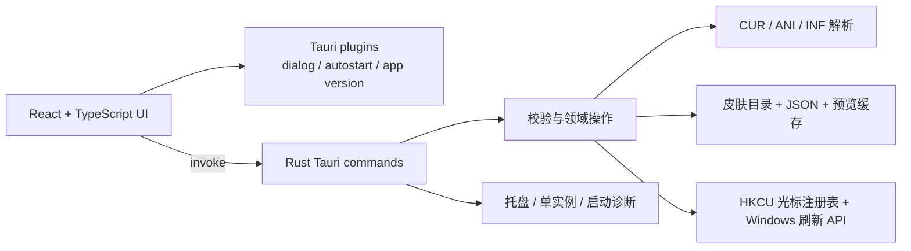
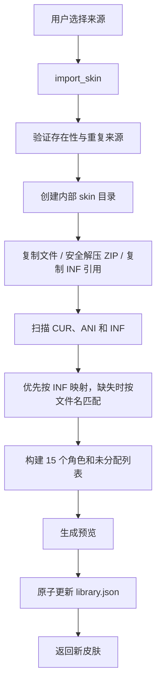

# 系统架构

本文说明 Cursor Skin Manager 的模块边界、核心数据流和 Windows 集成方式。开发环境与命令见 [`DEVELOPMENT.md`](DEVELOPMENT.md)，持久化字段见 [`DATA_FORMAT.md`](DATA_FORMAT.md)。

## 设计目标

当前应用只处理 Windows 本地光标皮肤 MVP：

- 导入本地文件夹、ZIP、`.cur`、`.ani` 和 `install.inf`。
- 解析并预览一套光标。
- 将已有角色应用到 Windows 当前用户。
- 替换角色、重新分配未识别文件、恢复默认和删除本地副本。
- 在失败时尽量保留原始下载文件、已保存映射和可诊断日志。

项目不包含在线市场、账号、收藏、标签或云同步。架构修改应先证明其服务于上述边界。

## 总体结构

### 目录职责

| 路径 | 主要职责 |
| --- | --- |
| `src/` | React 界面、TypeScript 类型、Tauri 调用和前端测试 |
| `src-tauri/src/lib.rs` | command、皮肤解析、预览、持久化、注册表、托盘和 Rust 测试 |
| `src-tauri/src/main.rs` | Windows GUI 入口和启动诊断安装 |
| `src-tauri/tauri.conf.json` | 窗口、构建、图标、WebView2 和安装包配置 |
| `src-tauri/capabilities/` | Tauri 权限声明 |
| `scripts/` | Windows 打包、便携版和发布辅助脚本 |
| `docs/` | 产品、开发、架构、品牌和维护文档 |

Rust 逻辑目前集中在 `lib.rs`。新增代码应优先保持现有行为和测试稳定；当某一领域已经形成清晰边界时，再通过小型、可审查的重构拆分模块。

## 前后端边界

### React 前端负责

- 展示皮肤列表、15 个角色、未分配文件、设置和操作反馈。
- 管理 hover、focus、弹窗、忙碌、成功和错误状态。
- 使用 Tauri dialog 插件打开 Windows 原生文件选择器。
- 使用 autostart 和 app version 插件读取对应系统能力。
- 调用 Rust command，并使用后端返回的完整皮肤列表或皮肤对象刷新界面。

### Rust 后端负责

- 验证皮肤 ID、角色、文件类型、文件结构、路径归属和文件存在性。
- 复制、解压、删除和打开应用内部文件。
- 解析 `.cur`、`.ani`、`install.inf`，生成预览和角色映射。
- 读取、备份和写入 `library.json`、`settings.json`。
- 修改 `HKEY_CURRENT_USER` 光标配置并请求 Windows 刷新。
- 记录操作日志、启动故障和降级结果。

前端不得直接写 `library.json`、修改皮肤目录或写注册表。即使 UI 已经限制输入，Rust command 仍必须把所有参数视为不可信数据并重新验证。

浏览器中的 `npm run dev` 使用演示数据，只用于快速检查布局。涉及文件系统、注册表、托盘和原生窗口的行为必须通过 `npm run tauri -- dev` 验证。

## Command 边界

当前注册的主要 command 如下：

| Command | 作用 |
| --- | --- |
| `load_library` | 读取、恢复、刷新并返回本地皮肤库 |
| `import_skin` | 导入文件夹、ZIP、INF 或单个光标文件 |
| `replace_cursor_role` | 用外部 `.cur/.ani` 替换指定角色 |
| `assign_unassigned_cursor` | 将内部未分配文件交换到指定角色 |
| `apply_skin` | 将皮肤已有角色写入当前用户注册表 |
| `refresh_system_cursors` | 请求 Windows 重新加载当前光标 |
| `reset_system_cursors` | 写回 Windows 默认光标方案 |
| `delete_skin` | 必要时恢复默认，然后删除一个内部皮肤 |
| `clear_all_skins` | 必要时恢复默认，然后清空内部皮肤库 |
| `open_skin_dir` | 打开指定皮肤的内部目录 |
| `load_app_settings`、`set_close_to_tray` | 读取和更新应用设置 |
| `open_log_file` | 打开应用日志 |

新增 command 时需要同时完成参数校验、日志、失败清理、handler 注册和测试。不要把一组需要一致提交的文件操作拆成多个由前端排序调用的 command。

## 核心数据流

### 启动与加载

1. `main.rs` 在进入 Tauri runtime 前安装 panic 和启动错误诊断。
2. 单实例插件确保第二次启动只显示已有主窗口。
3. setup 读取设置并尝试创建托盘；托盘失败会记录日志并降级为普通窗口关闭行为。
4. 前端调用 `load_library`。
5. 后端读取主数据；主文件损坏时尝试备份，必要时保留损坏副本并创建空库。
6. 后端迁移旧数据目录、刷新文件存在状态、补齐预览并重新检测 `isApplied`。
7. 返回的数据只用于前端渲染，磁盘内容仍由后端维护。

### 导入

- ZIP 条目必须通过安全路径检查，不能越出新皮肤目录。
- INF 支持带 BOM 的 UTF-16、UTF-8，以及常见 GBK 来源文本。
- 来源文件只复制，不移动或删除。
- 皮肤内部没有任何 `.cur/.ani` 时导入失败，并清理刚创建的目录。

### 预览

1. 只对 `.cur` 和 `.ani` 建立预览。
2. CUR 选择可解析的高质量图像条目；支持嵌入 PNG 和 DIB。
3. ANI 解析 RIFF/ACON 容器，寻找首个可用图标帧。
4. 可见像素会按透明边界裁剪，再居中到带留白的正方形画布。
5. PNG 缓存在皮肤目录下的 `.previews/`。
6. 返回前端时补充 data URL；写入 JSON 前清除该临时字段，避免数据库膨胀。

ANI 在 UI 中只展示首个可解析帧，原始动画文件仍会完整应用到 Windows。

### 应用与状态检测

1. `apply_skin` 重新读取目标皮肤并检查内部文件。
2. 仅对当前存在且已分配的角色写入 `HKCU\Control Panel\Cursors`。
3. 未设置角色保留当前系统值，因此不完整皮肤仍可应用已有部分。
4. 后端调用 Windows `SPI_SETCURSORS` 并广播设置变化。
5. 随后重新读取注册表。只有全部已设置角色都与当前注册表值一致，并且至少有一个已设置角色时，皮肤才标记为 `isApplied=true`。

恢复默认时，后端优先从系统的 `Windows Aero` 方案读取默认路径，再回退到 `%SystemRoot%\Cursors` 中的已知文件。所有写入都限制在当前用户范围，不请求管理员权限。

### 替换角色

1. 前端通过原生文件选择器取得外部 `.cur/.ani` 路径，并调用 `replace_cursor_role`。
2. 后端验证文件存在、非空、扩展名、容器结构和可见预览。
3. 新文件以不会覆盖现有文件的名称复制到当前皮肤 `custom/` 目录。
4. 后端在内存副本中更新目标角色。
5. 旧文件若未被其他角色引用且不在未分配列表中，则进入未分配列表。
6. 重新计算文件数、完整度、预览和应用状态，再写入数据库。
7. 写入失败时恢复内存映射并删除新复制文件及其预览。

替换不会静默改写注册表。若皮肤原本正在使用，映射变化后会重新检测为未应用，用户需要再次点击“应用此皮肤”。

### 分配未识别文件

1. `assign_unassigned_cursor` 先规范化文件路径，并确认它属于当前皮肤内部目录。
2. 选中的未分配文件从列表中移除并成为目标角色文件。
3. 目标角色原文件若未被其他角色引用，则交换到未分配列表。
4. 其他角色映射保持不变。
5. 数据库写入失败时恢复原映射，并清理本次新生成的预览。

该 command 不接受任意外部路径。外部文件必须走替换流程，先复制到受管理目录。

### 删除、清空与恢复默认

- 删除正在使用的皮肤前，先恢复默认光标，再移除该皮肤内部目录和库记录。
- 清空全部皮肤前执行同样的当前状态检查，然后重建空皮肤目录和空库。
- 删除操作永远不应触碰 `sourcePath` 指向的原始下载目录。
- 设置中的恢复默认只修改当前用户光标，不删除皮肤。

## 持久化与恢复

固定数据根目录是 `%APPDATA%\CursorSkinManager`。后端会把旧版 Tauri 应用数据目录迁移到该位置，并更新保存的内部绝对路径。

`library.json` 和 `settings.json` 使用相同的替换协议：

1. 在目标文件同目录写入临时文件。
2. 序列化为格式化 JSON，并调用 `sync_all`。
3. 将有效的当前文件复制为 `.bak.json`。
4. 移除当前文件，再将临时文件重命名为正式文件。
5. 最后一步失败时尝试从备份恢复。

读取主文件失败时，后端尝试备份。主文件和备份都不可解析时，原文件会以带时间标记的损坏副本保留，随后创建空数据。完整字段和恢复规则见 [`DATA_FORMAT.md`](DATA_FORMAT.md)。

## Windows 生命周期

### 托盘

- 默认 `closeToTray=true`。
- 关闭主窗口时，如果托盘可用，应用阻止退出并隐藏窗口。
- 托盘左键或“显示主窗口”菜单恢复窗口。
- 只有托盘“退出”或关闭到托盘被禁用时才结束进程。
- 托盘创建失败时记录原因、标记不可用并继续启动，不让辅助功能阻断主窗口。

### 单实例

再次启动同一应用时，单实例插件把焦点交给已有主窗口。不要在前端自行创建第二套托盘或窗口状态。

### 启动诊断

- `startup.log` 记录 Tauri runtime 之前的 panic 和启动错误。
- `app.log` 记录 command、皮肤 ID、角色、文件变更和失败原因。
- release 构建使用 Windows GUI 子系统，不显示命令窗口。
- 日志可能包含本地路径；提交 Issue 前必须去除用户名和隐私信息。

## 权限与安全边界

- 注册表写入仅限 `HKEY_CURRENT_USER`，系统默认方案从 `HKEY_LOCAL_MACHINE` 只读获取。
- Tauri capability 只开放当前界面需要的 dialog、opener 和 autostart 权限。
- ZIP 解压必须拒绝目录穿越。
- 外部文件不能成为持久化映射，必须先复制到应用内部。
- 内部路径比较需要考虑 Windows 大小写不敏感、中文、空格和特殊字符。
- 所有删除目标都必须从可信皮肤记录解析，并确认属于应用数据范围。

## 当前约束

这些约束是贡献者修改高风险路径时需要关注的地方：

- 注册表角色逐项写入，Windows 注册表修改不是跨 15 个值的事务。中途失败可能需要重新应用或恢复默认。
- 删除和清空会先处理内部目录，再更新 JSON；持久化阶段失败时无法自动恢复已经删除的文件。
- 导入在“未发现光标文件”路径会主动清理目录，但更早的复制、解压或分析异常仍可能留下不被库引用的内部目录。
- `library.json` 当前没有显式 `schemaVersion`，不兼容字段变化需要同时提供迁移逻辑和旧数据测试。
- ANI 预览不播放完整动画，只显示首个可解析帧。
- ARM64 尚未完成与 x64 相同范围的验证。

修复这些限制时，应提交独立 PR，并包含失败注入、回滚和旧数据兼容测试，避免与普通 UI 修改混在一起。

## 修改检查清单

涉及核心数据流的 PR 至少确认：

- 前端没有直接修改文件、JSON 或注册表。
- 后端重新验证所有路径、角色和文件内容。
- 失败路径不会修改用户原始下载目录。
- 新文件使用无覆盖命名，旧文件共享引用得到保留。
- `library.json` 写入失败能恢复映射和本次新增文件。
- 应用状态按全部已设置角色重新检测。
- 中文路径、空格、大小写扩展名、CUR、ANI 和 INF 有相应测试。
- 托盘、单实例、删除当前皮肤和恢复默认没有回归。
